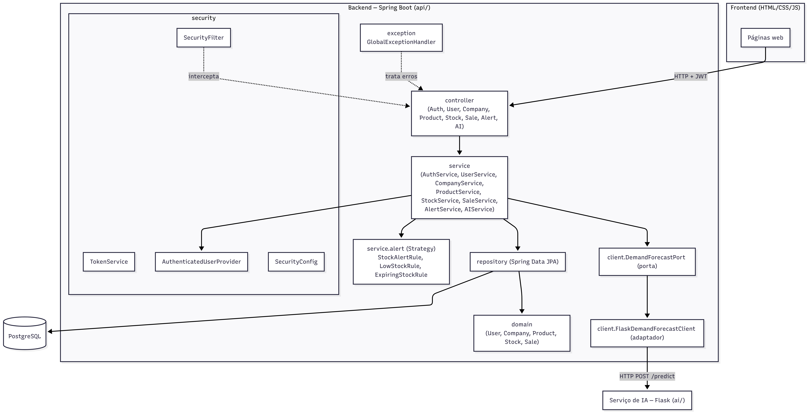

# Diagrama 1 — Arquitetura geral do sistema

Visão de containers e das camadas internas do backend `api/`. Representa os
artefatos reais: frontend estático, API Spring Boot, banco PostgreSQL e o serviço
de IA em Flask (consumido via porta/adaptador).



<details>
<summary><b>Código-fonte Mermaid (Clique para expandir)</b></summary>

```mermaid
flowchart TB
    subgraph Client["Frontend (HTML/CSS/JS)"]
        FE[Páginas web]
    end

    subgraph API["Backend — Spring Boot (api/)"]
        direction TB
        subgraph Sec["security"]
            FILTER[SecurityFilter]
            TOKEN[TokenService]
            AUP[AuthenticatedUserProvider]
            CFG[SecurityConfig]
        end
        CTRL["controller<br/>(Auth, User, Company, Product, Stock, Sale, Alert, AI)"]
        SVC["service<br/>(AuthService, UserService, CompanyService,<br/>ProductService, StockService, SaleService,<br/>AlertService, AIService)"]
        STRAT["service.alert (Strategy)<br/>StockAlertRule, LowStockRule, ExpiringStockRule"]
        REPO["repository (Spring Data JPA)"]
        DOM["domain<br/>(User, Company, Product, Stock, Sale)"]
        PORT["client.DemandForecastPort (porta)"]
        ADAPT["client.FlaskDemandForecastClient (adaptador)"]
        EXC["exception<br/>GlobalExceptionHandler"]
    end

    DB[("PostgreSQL")]
    AISVC["Serviço de IA — Flask (ai/)"]

    FE -->|HTTP + JWT| CTRL
    FILTER -.intercepta.-> CTRL
    CTRL --> SVC
    SVC --> AUP
    SVC --> STRAT
    SVC --> REPO
    SVC --> PORT
    PORT --> ADAPT
    ADAPT -->|HTTP POST /predict| AISVC
    REPO --> DB
    REPO --> DOM
    EXC -.trata erros.-> CTRL