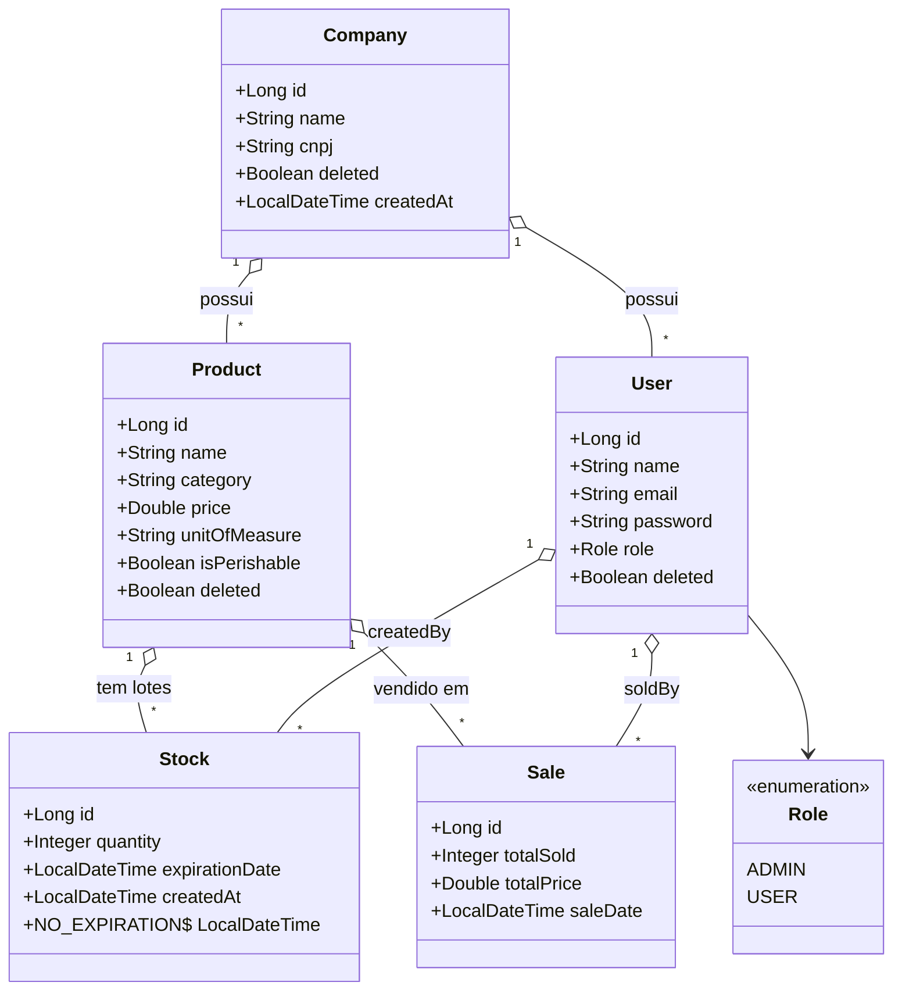
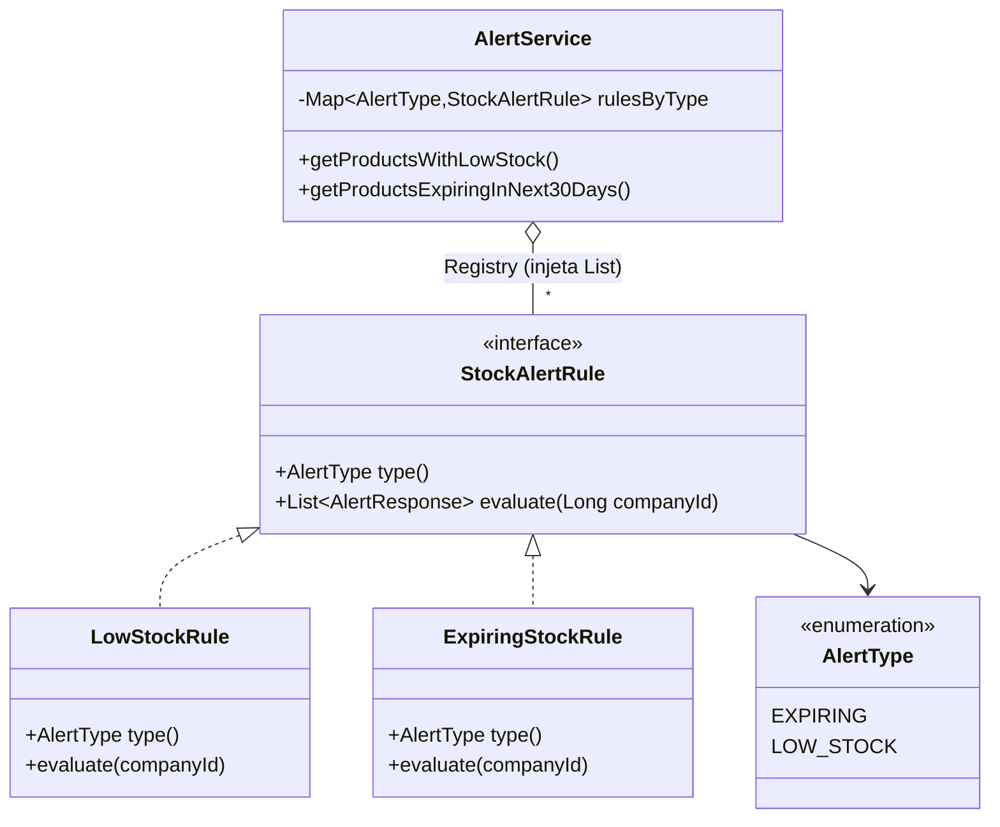
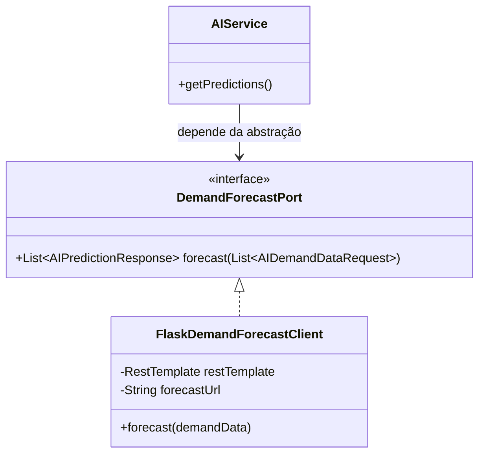
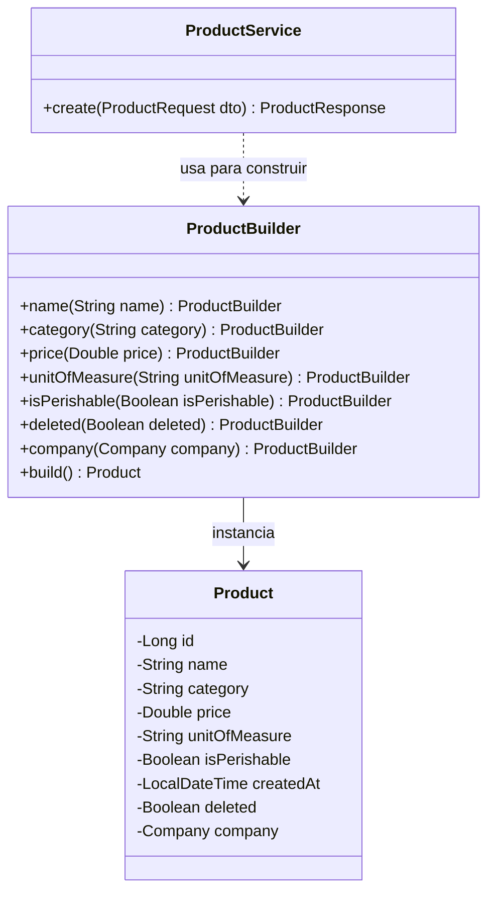

# Diagrama 2 — Diagrama de classes

Destaca o domínio (entidades e relações) e os dois padrões estruturais/de
comportamento centrais: **Strategy** (alertas) e **Adapter** (IA),
além do **Builder**.

## Domínio

## Geral
.png)

## Padrão Strategy (alertas)
.png)

## Padrão Adapter (IA)
.png)

## Padrão Builder
.png)

<b>Código-fonte Mermaid (Clique para expandir)</b>

## Geral

## Padrão Strategy (alertas)

## Padrão Adapter (IA)

## Padrão Builder

