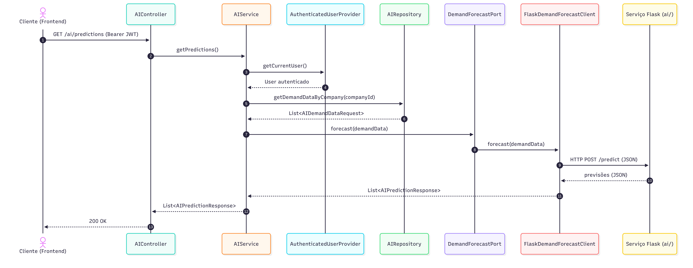
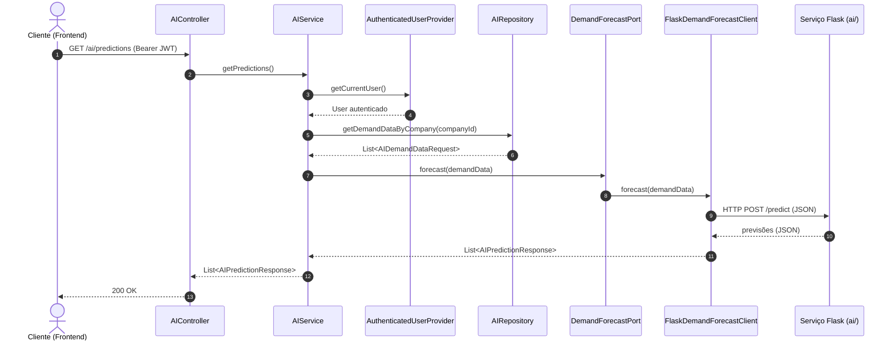

# Diagrama 4 — Sequência: previsão de demanda (IA)

Fluxo de `GET /ai/predictions`. O `AIService` agrega dados de demanda da empresa e
delega a previsão à **porta** `DemandForecastPort`, implementada pelo adaptador
que conversa com o serviço Flask.

<b>Código-fonte Mermaid (Clique para expandir)</b>

